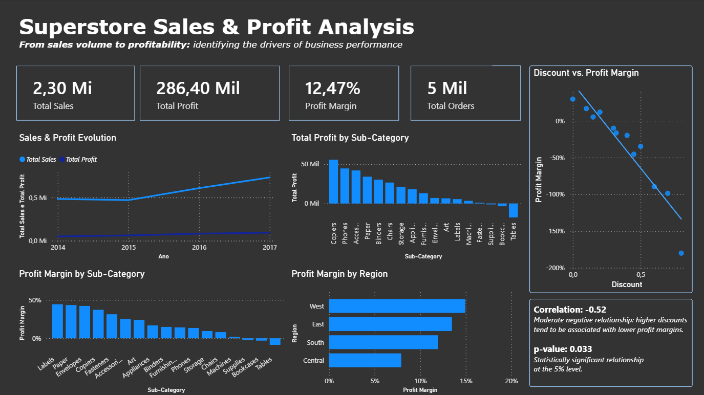

# superstore-sales-analysis

# Superstore Sales & Profit Analysis

> **Quantidade não significa lucro.**
> **Quantity does not necessarily mean profitability.**

---


## 📊 Visão geral do projeto

Este projeto apresenta uma análise exploratória e de negócio utilizando o dataset **Sample Superstore**, com o objetivo de entender a relação entre **volume de vendas e lucratividade**.

A principal pergunta da análise foi:

> **Vender mais significa necessariamente gerar mais lucro?**

Para responder a essa pergunta, analisamos o desempenho ao longo do tempo, categorias e subcategorias de produtos, regiões, descontos e margem de lucro.

O projeto combina **Python para análise exploratória e testes estatísticos** com **Power BI para visualização e construção do dashboard interativo**.

---

## 🎯 Objetivo de negócio

O objetivo é identificar os principais fatores relacionados à lucratividade do negócio, analisando:

* Evolução de vendas e lucro ao longo do tempo;
* Desempenho por categoria e subcategoria;
* Desempenho regional;
* Relação entre desconto e margem de lucro;
* Diferença entre **lucro absoluto** e **margem de lucro**.

A análise busca ir além do volume de vendas e entender **como as vendas são convertidas em lucro**.

---

## 📈 Dashboard



### Principais indicadores

| Indicador     |      Resultado |
| ------------- | -------------: |
| Total Sales   |    US$ 2,30 Mi |
| Total Profit  | US$ 286,40 Mil |
| Profit Margin |         12,47% |
| Total Orders  |         ~5 Mil |

---

## 🔎 Principais descobertas

### 1. Crescimento de vendas não significa crescimento proporcional do lucro

As vendas apresentaram crescimento ao longo do período analisado, principalmente entre 2016 e 2017.

Entretanto, o crescimento do lucro não ocorreu exatamente na mesma proporção.

Isso levou a análise para além de vendas e volume, buscando entender os fatores relacionados à lucratividade.

### 2. Algumas subcategorias são responsáveis por grande parte do lucro

A análise mostrou que **Copiers e Phones** estão entre as subcategorias que mais contribuem para o lucro total.

Porém, gerar mais lucro absoluto não significa necessariamente apresentar a maior margem de lucro.

### 3. Lucro absoluto e margem de lucro são métricas diferentes

Uma subcategoria pode gerar um grande valor de lucro devido ao seu volume de vendas, mesmo apresentando uma margem relativamente menor.

Por outro lado, uma subcategoria pode apresentar uma margem elevada, mas gerar menos lucro absoluto.

Essa diferença é central para a análise:

> **Quantidade não significa lucro.**

### 4. O desempenho varia entre as regiões

A análise regional mostrou diferenças relevantes de margem de lucro:

| Região  | Margem de Lucro |
| ------- | --------------: |
| West    |          14,94% |
| East    |          13,48% |
| South   |          11,93% |
| Central |           7,92% |

A região **West** apresentou a maior margem, enquanto **Central** apresentou a menor.

Esse resultado levanta uma nova questão de negócio: **o que a região West está fazendo de diferente em relação à Central?**

### 5. Desconto apresenta relação negativa com margem de lucro

Foi realizado um teste estatístico para investigar a relação entre **Discount** e **Profit Margin**.

**Correlação:** `-0,5188`

**P-value:** `0,0329`

Os resultados indicam uma **relação negativa moderada** entre desconto e margem de lucro, estatisticamente significativa ao nível de 5%.

Em termos de negócio:

> **Descontos maiores tendem a estar associados a margens de lucro menores.**

Entretanto, correlação não significa causalidade. Portanto, o desconto deve ser tratado como **um possível fator relacionado à lucratividade**, e não como a única explicação para as diferenças observadas.

---

## 🧪 Teste de hipótese

### Hipóteses

**H₀ — Hipótese nula:**
Não existe uma relação estatisticamente significativa entre desconto e margem de lucro.

**H₁ — Hipótese alternativa:**
Existe uma relação estatisticamente significativa entre desconto e margem de lucro.

### Resultado

Como o **p-value = 0,0329**, que é menor que o nível de significância de 5%, rejeitamos a hipótese nula.

Portanto, os dados fornecem evidências de uma **relação negativa estatisticamente significativa entre desconto e margem de lucro**.

---

## 🛠️ Ferramentas utilizadas

* **Python**

  * Pandas
  * NumPy
  * Matplotlib
  * Seaborn
  * SciPy
* **Power BI**

  * Power Query
  * DAX
  * Dashboard interativo
* **SQL**

  * Utilizado no processo de desenvolvimento e aprimoramento das habilidades de análise de dados
* **Git & GitHub**

  * Versionamento e documentação do projeto

---

## 📂 Estrutura do projeto

```text
superstore-sales-profit-analysis/
│
├── README.md
│
├── images/
│   └── dashboard.png
│
├── analysis/
│   └── ...
│
├── data/
│   └── ...
│
└── dashboard/
    └── superstore_dashboard.pbix
```

---

## 💡 Principal insight de negócio

A principal conclusão desta análise pode ser resumida em:

> **Quantidade não significa lucro.**

O volume de vendas é importante, mas não é suficiente para avaliar o desempenho de um negócio.

Para compreender a lucratividade, é necessário analisar conjuntamente:

* Volume de vendas;
* Lucro absoluto;
* Margem de lucro;
* Descontos;
* Mix de produtos;
* Desempenho regional.

---

## 🚀 Próximos passos

Algumas possibilidades para aprofundar a análise:

* Investigar a estrutura de custos das subcategorias com maior e menor margem;
* Comparar estratégias de desconto entre produtos e regiões;
* Investigar por que a região Central apresenta desempenho inferior à West;
* Analisar a lucratividade por cliente;
* Desenvolver modelos preditivos de vendas e lucro;
* Criar análises mais detalhadas utilizando SQL;
* Expandir o dashboard com filtros e análises de drill-through.

---

## 📌 Conclusão

Este projeto demonstra um fluxo completo de análise de dados:

**Dados → Limpeza → Análise Exploratória → Hipótese → Teste Estatístico → Visualização → Insight de Negócio**

O objetivo não foi apenas descobrir **quanto a empresa vende**, mas entender **onde o lucro é gerado e quais fatores estão relacionados à lucratividade**.

---

# 🇺🇸 English Version

## 📊 Project Overview

This project presents an exploratory and business analysis using the **Sample Superstore** dataset to understand the relationship between **sales volume and profitability**.

The main question behind the analysis was:

> **Does higher sales volume necessarily translate into higher profitability?**

To answer this question, the analysis examines performance over time, product categories and sub-categories, regional performance, discounts, and profit margins.

The project combines **Python for exploratory analysis and statistical testing** with **Power BI for visualization and interactive dashboard development**.

---

## 🎯 Business Objective

The objective is to identify the main factors associated with business profitability by analyzing:

* Sales and profit evolution over time;
* Category and sub-category performance;
* Regional performance;
* The relationship between discount and profit margin;
* The difference between **absolute profit** and **profit margin**.

The analysis goes beyond sales volume to understand **how effectively sales are converted into profit**.

---

## 📈 Dashboard


### Key Performance Indicators

| Metric        |   Result |
| ------------- | -------: |
| Total Sales   |   $2.30M |
| Total Profit  | $286.40K |
| Profit Margin |   12.47% |
| Total Orders  |      ~5K |

---

## 🔎 Key Findings

### 1. Sales growth does not necessarily mean proportional profit growth

Sales increased throughout the analyzed period, particularly between 2016 and 2017.

However, profit did not increase at exactly the same rate.

This motivated a deeper investigation into profitability rather than focusing only on sales volume.

### 2. Some sub-categories contribute significantly to total profit

The analysis showed that **Copiers and Phones** are among the strongest contributors to total profit.

However, generating more absolute profit does not necessarily mean having the highest profit margin.

### 3. Absolute profit and profit margin tell different stories

A sub-category can generate a large amount of profit because of its sales volume while having a relatively lower profit margin.

Conversely, a smaller sub-category can achieve a higher margin while generating less absolute profit.

This distinction is central to the analysis:

> **Quantity does not necessarily mean profitability.**

### 4. Regional performance varies significantly

The regional analysis revealed meaningful differences in profit margin:

| Region  | Profit Margin |
| ------- | ------------: |
| West    |        14.94% |
| East    |        13.48% |
| South   |        11.93% |
| Central |         7.92% |

The **West** region achieved the highest profit margin, while **Central** had the lowest.

This raises an important business question:

> **What is West doing differently compared with Central?**

### 5. Discounts show a negative relationship with profit margin

A statistical test was performed to investigate the relationship between **Discount** and **Profit Margin**.

**Correlation:** `-0.5188`

**P-value:** `0.0329`

The results indicate a **moderate negative relationship** between discount and profit margin, statistically significant at the 5% level.

From a business perspective:

> **Higher discounts tend to be associated with lower profit margins.**

However, correlation does not imply causation. Therefore, discount should be treated as **one potential factor associated with profitability**, rather than the sole explanation for the observed differences.

---

## 🧪 Hypothesis Test

### Hypotheses

**H₀ — Null hypothesis:**
There is no statistically significant relationship between discount and profit margin.

**H₁ — Alternative hypothesis:**
There is a statistically significant relationship between discount and profit margin.

### Result

Because the **p-value = 0.0329**, which is below the 5% significance level, we reject the null hypothesis.

Therefore, the data provides evidence of a **statistically significant negative relationship between discount and profit margin**.

---

## 🛠️ Tools & Technologies

* **Python**

  * Pandas
  * NumPy
  * Matplotlib
  * Seaborn
  * SciPy
* **Power BI**

  * Power Query
  * DAX
  * Interactive dashboard development
* **SQL**

  * Used as part of the data-analysis learning and skill-development process
* **Git & GitHub**

  * Version control and project documentation

---

## 📂 Project Structure

```text
superstore-sales-profit-analysis/
│
├── README.md
│
├── images/
│   └── dashboard.png
│
├── analysis/
│   └── ...
│
├── data/
│   └── ...
│
└── dashboard/
    └── superstore_dashboard.pbix
```

---

## 💡 Main Business Insight

The main conclusion of this analysis can be summarized as:

> **Quantity does not necessarily mean profitability.**

Sales volume is important, but it is not sufficient to evaluate business performance.

Understanding profitability requires looking at:

* Sales volume;
* Absolute profit;
* Profit margin;
* Discounts;
* Product mix;
* Regional performance.

---

## 🚀 Future Improvements

Potential next steps for the analysis include:

* Investigating the cost structure of high- and low-margin sub-categories;
* Comparing discount strategies across products and regions;
* Investigating why Central performs significantly worse than West;
* Analyzing profitability at the customer level;
* Developing predictive models for sales and profit;
* Expanding the analysis using SQL;
* Adding more interactive filters and drill-through capabilities to the Power BI dashboard.

---

## 📌 Conclusion

This project demonstrates an end-to-end data-analysis workflow:

**Data → Cleaning → Exploratory Analysis → Hypothesis → Statistical Testing → Visualization → Business Insight**

The goal was not simply to determine **how much the business sells**, but to understand **where profit comes from and which factors are associated with profitability**.
